<div align="center">

# 🛒 E-commerce Data Platform

**End-to-end analytics platform: synthetic data generation → PostgreSQL star-schema warehouse → statistical & machine-learning analytics → Power BI dashboard**


</div>

---

## 📌 Table of contents

1. [Project overview](#-project-overview)
2. [Key results at a glance](#-key-results-at-a-glance)
3. [Architecture](#-architecture)
4. [Tech stack](#-tech-stack)
5. [Data model](#-data-model)
6. [Methodology](#-methodology)
7. [Analytical findings](#-analytical-findings)
8. [Power BI dashboard](#-power-bi-dashboard)
9. [Repository structure](#-repository-structure)
10. [Getting started](#-getting-started)
11. [Known limitations & roadmap](#-known-limitations--roadmap)
12. [License & author](#-license--author)

---

## 🎯 Project overview

This project simulates the data landscape of a mid-sized online retailer and builds the **full analytical value chain** on top of it – the way it would be done in a real data team:

| Layer | What happens |
|---|---|
| **Data generation** | A reproducible generator produces ~500 000 orders (≈1.15 M order lines), 50 000 customers, 10 000 products across 50 categories, 500 suppliers and 100 employees covering **2021-01-01 → 2025-12-31**. |
| **ETL** | CSV files are bulk-loaded into a `staging` schema with PostgreSQL `COPY`, then transformed into a `warehouse` schema (star schema) with idempotent upserts and batched fact loading. |
| **SQL analytics** | Data-quality checks (14 tests) and business analyses (sales, customers, products) written in pure SQL. |
| **Statistical analytics** | Trend decomposition (STL), seasonality, growth rates, volatility and a 6-signal **ensemble anomaly detector**. |
| **Machine learning** | RFM customer segmentation, product segmentation, Isolation-Forest anomaly detection, gradient-boosting **sales forecasting** and market-basket (association-rule) analysis. |
| **BI** | A 4-page dark-themed **Power BI** report (Executive, Sales, Product, Customer). |

---

## 📊 Key results at a glance

| KPI | Value |
|---|---|
| Orders | **500 000** |
| Order lines / units sold | **1 147 325** / **≈1.20 M** |
| Gross revenue | **≈ 294.6 M** |
| Gross profit | **≈ 73.3 M** (margin **24.9 %**) |
| Average order value | **≈ 589** |
| Revenue CAGR 2021 → 2025 | **+9.0 %** |
| Seasonality | **Dec is 2.4× Jan**; Nov + Dec generate **26.7 %** of revenue |
| Forecast accuracy (30-day hold-out) | **MAE 6.4 %** (RMSE 26.2 k) |
| Customer segmentation | 60 % of customers (*Loyal High-Value*) generate **79.5 %** of revenue and **81.2 %** of profit |
| Product segmentation | 24.7 % of products (*High-Value*) generate **63.6 %** of revenue |

> ℹ️ Figures are *gross* – cancelled (≈5 %) and returned (≈3 %) orders are kept in the fact table and flagged via `order_status`.

---

## 🏗 Architecture

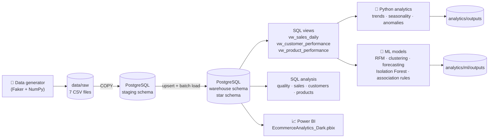

---

## 🧰 Tech stack

| Area | Technologies |
|---|---|
| **Language** | Python 3.10+, SQL (PostgreSQL dialect) |
| **Data generation** | `Faker`, `NumPy`, `pandas` (seeded → reproducible) |
| **Database** | PostgreSQL, `psycopg2`, `COPY … FROM STDIN`, `ON CONFLICT … DO UPDATE` |
| **Configuration** | `python-dotenv` (`.env`, credentials kept out of version control) |
| **Statistics** | `statsmodels` (STL decomposition), `scipy`, rolling statistics, Z-score, IQR |
| **Machine learning** | `scikit-learn` – K-Means, Gaussian Mixture, DBSCAN, PCA, Isolation Forest, HistGradientBoostingRegressor |
| **Visualisation** | `matplotlib`, `seaborn`, **Power BI** (PBIR project format, custom *Ecommerce Dark* theme) |
| **Tooling** | Git, `.gitattributes` (LF normalisation), MIT licence |

---

## 🗄 Data model

The warehouse follows a classic **Kimball star schema** with a single fact table at *order-line* grain.

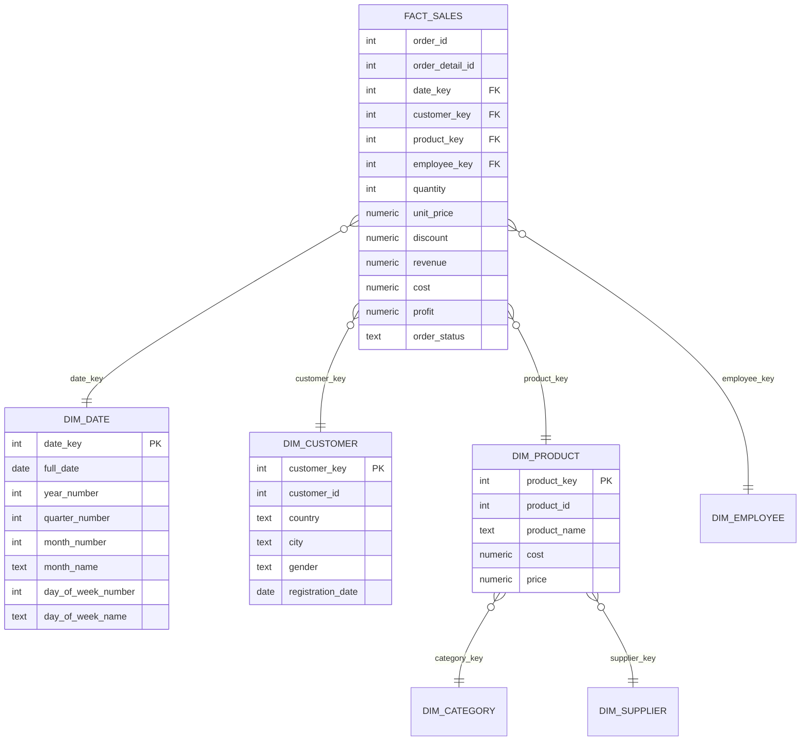

**Derived measures** (computed during ETL): `cost = quantity × product.cost`, `profit = revenue − cost`, `revenue = quantity × unit_price × (1 − discount)`.

---

## 🔬 Methodology

### 1. Data generation (`generator/`)
* Fully **seeded** (`SEED = 42`) – every run is reproducible.
* Realistic distributions: log-normal product cost, price = cost × U(1.2, 2.5), 1–5 items per order, discount tiers 0–20 %, order status mix (completed / cancelled / returned).

### 2. ETL (`etl/`)
1. **Staging load** – `TRUNCATE … RESTART IDENTITY CASCADE`, then `COPY` straight from CSV (fast, transactional, rolled back on any error).
2. **Dimensions** – `INSERT … ON CONFLICT DO UPDATE` → idempotent, safe to re-run.
3. **Date dimension** – built from distinct order dates (`YYYYMMDD` surrogate key).
4. **Fact table** – loaded in **25 000-order batches** with surrogate-key lookups via `INNER JOIN`, followed by `ANALYZE` to refresh planner statistics.

### 3. Data-quality framework (`sql/01_data_quality.sql`)
14 automated checks: row counts, NULL audit of every fact column, invalid quantity / price / discount / revenue, profit-formula reconciliation (±0.01), duplicate `order_detail_id`, and **referential-integrity** tests against all five dimensions.

### 4. Statistical analytics (`analytics/`)
| Module | Technique |
|---|---|
| `sales_trends.py` | 30-day moving averages, top revenue/profit days |
| `advanced_trends.py` | 7/30/90-day rolling means, linear trend (slope, R²), 30-day & YoY growth, rolling volatility, AOV and margin trends, cumulative performance, revenue index |
| `seasonality.py` | Month / weekday / quarter profiles, **STL decomposition** (period = 365, robust) and seasonality-strength metric |
| `anomaly_detection.py` | **Ensemble of 6 signals** – global Z-score, IQR, rolling Z-score (30 d), YoY deviation (±30 %), STL residual Z-score, deviation from an *expected-value* model (median of rolling median, YoY and STL trend). Score 2 = *Warning*, ≥ 3 = *Anomaly*, ≥ 5 = *Extreme* |

### 5. Machine learning (`analytics/ml/`)
| Module | Method |
|---|---|
| `customer_rfm.py` | RFM + AOV, units, profit & margin → `log1p` transform (skew correction) → `StandardScaler` |
| `customer_segmentation.py` | **K-Means** (k = 2, selected by silhouette), PCA projection, segment profiling. Benchmarked against GMM and DBSCAN |
| `product_segmentation.py` | **K-Means** (k = 4) on units, orders, revenue, cost, profit and margin; PCA visual validation |
| `ml_anomaly_detection.py` | **Isolation Forest** (300 trees, contamination 2 %) on 15 engineered features (pct-changes, 7-day averages, ratios to rolling mean) |
| `forecasting.py` | **HistGradientBoostingRegressor** – calendar features, Fourier terms (sin/cos of day-of-year), lags (1, 7, 14, 30, 365), rolling means (7–90 d); chronological 30-day hold-out; recursive 365-day forecast |
| `association_rules.py` | Market-basket analysis: pair counting, **support / confidence / lift**, directional rules, minimum-support filters |

---

## 📈 Analytical findings

### Revenue trend & seasonality
Revenue grows steadily (**+9.0 % CAGR**, 48.7 M → 68.8 M) on top of a very pronounced yearly cycle.

| Year | Orders | Revenue | YoY | Profit |
|---|---:|---:|---:|---:|
| 2021 | 83 392 | 48.7 M | – | 12.1 M |
| 2022 | 90 920 | 53.6 M | +9.9 % | 13.3 M |
| 2023 | 100 225 | 59.1 M | +10.3 % | 14.7 M |
| 2024 | 109 010 | 64.3 M | +8.8 % | 16.0 M |
| 2025 | 116 453 | 68.8 M | +7.0 % | 17.1 M |

Growth is **volume-driven** – AOV stays almost flat (≈ 585 → ≈ 591) and profit margin remains stable at ≈ 25 %.

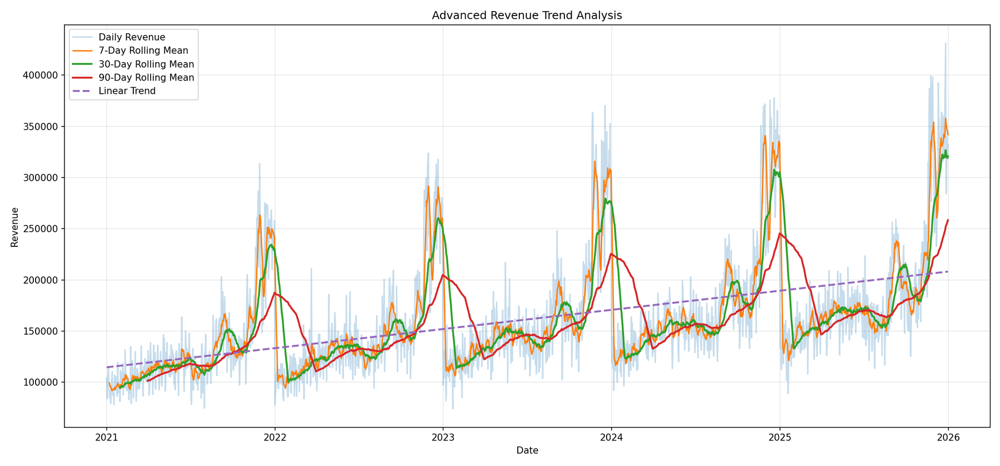

**STL decomposition** separates a near-linear upward trend from a strong seasonal component. The linear trend alone explains only ~22 % of daily variance – seasonality dominates.

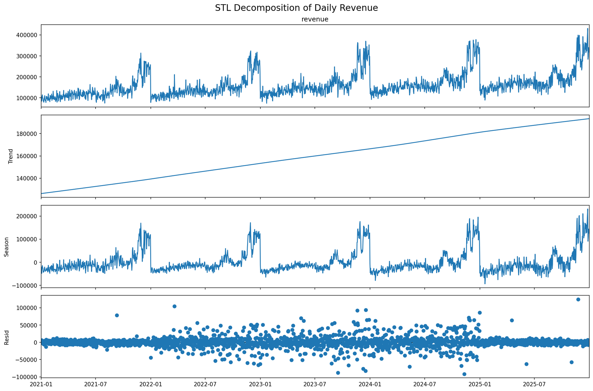

| Monthly profile | Weekday profile |
|---|---|
| 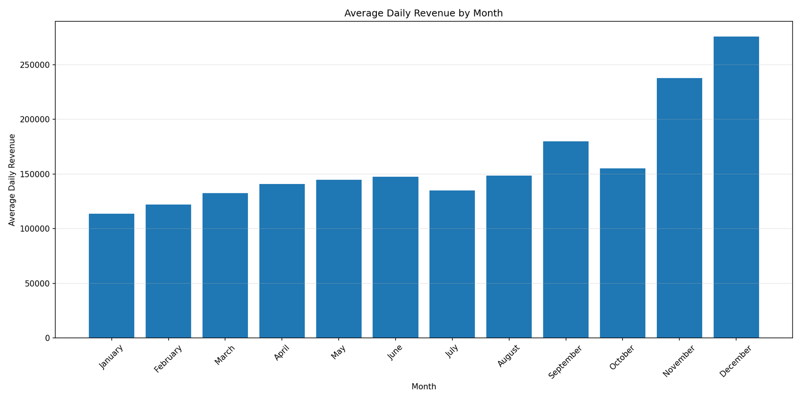 | 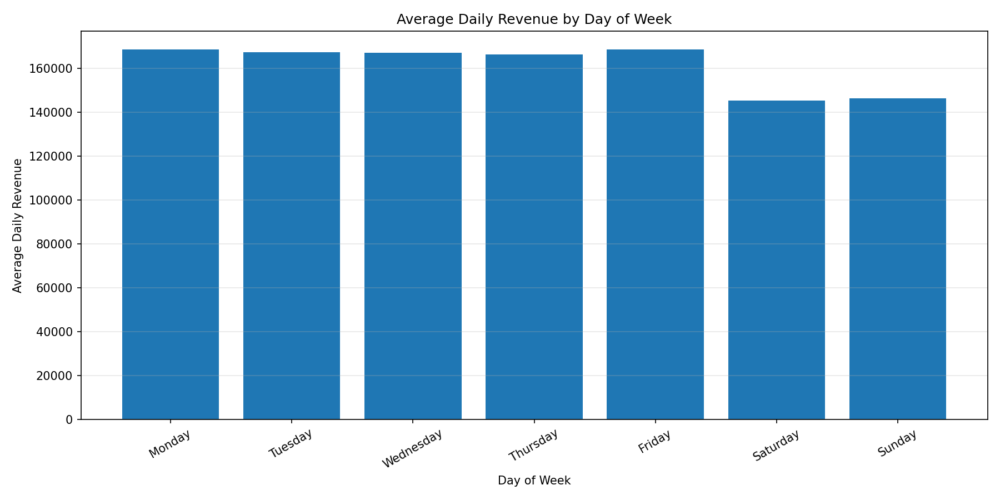 |

* **Q4 is 81 % stronger than Q1** (avg. daily revenue 222.8 k vs 123.1 k); **December ≈ 2.4 × January**.
* **Weekends are ≈ 13 % weaker** than weekdays (≈ 146 k vs ≈ 168 k per day).

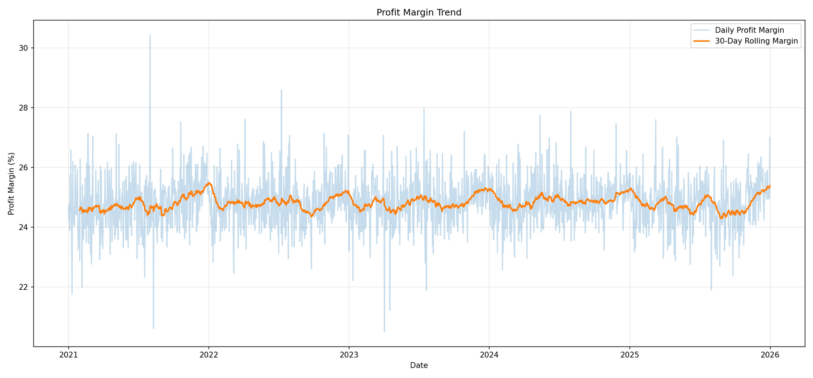

### Anomaly detection
Two independent approaches were applied and cross-checked:

* **Ensemble statistical detector** → 135 flagged days (91 *Warning*, 42 *Anomaly*, **2 *Extreme***: 2023-11-20 and 2025-11-24, +84 % / +79 % over expected revenue). 96 % of flags are *positive* spikes clustered in the pre-Christmas season.
* **Isolation Forest** → 37 anomalous days out of 1 820 (2.03 %): 27 unusually high-revenue days (Nov–Dec) and 10 unusually low ones, mostly **New Year's Day** (2022-01-01, 2023-01-01, 2025-01-01).

| Ensemble (statistical) | Isolation Forest (ML) |
|---|---|
| 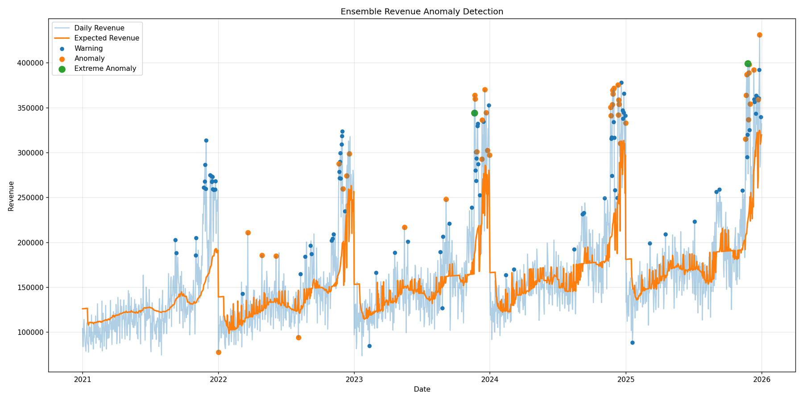 | 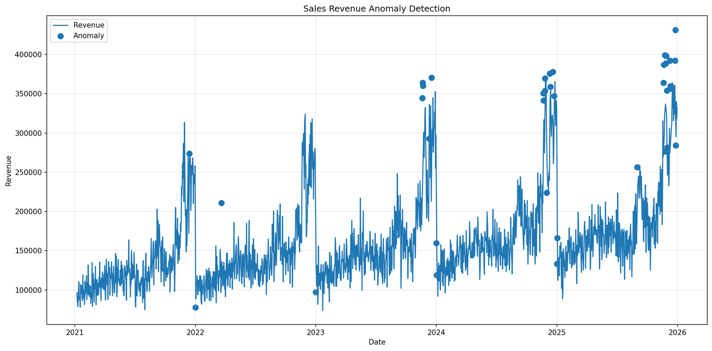 |

### Sales forecasting
A gradient-boosting model trained on calendar, lag and rolling features reproduces the seasonal shape well and predicts a **+5.6 % revenue increase for 2026** (≈ 72.7 M vs 68.8 M).

| Metric | Value |
|---|---|
| MAE | 20 477 (**6.38 %**) |
| RMSE | 26 236 |
| Validation | chronological hold-out, last 30 days (peak season) |

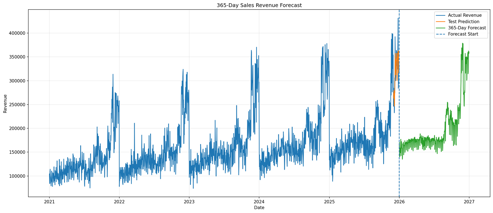

### Customer segmentation (RFM + K-Means)
Heavily right-skewed monetary values are normalised with `log1p` before scaling:

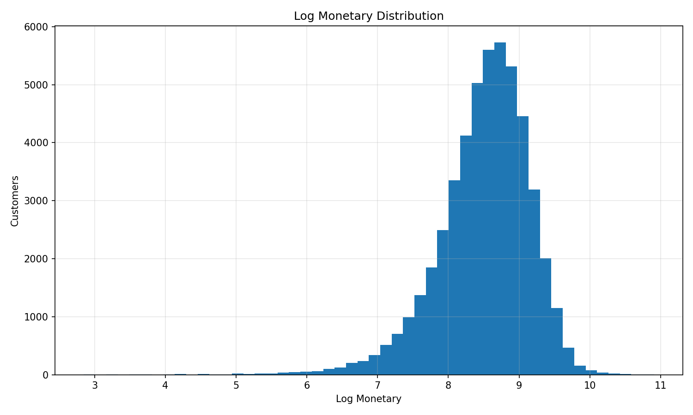

Model selection compared **K-Means (k = 2…10), Gaussian Mixture and DBSCAN (25 parameter combinations)** using Silhouette, Calinski-Harabasz and Davies-Bouldin indices. K-Means with **k = 2** gives the best balance (silhouette 0.316, CH 28 442, DB 1.21); GMM reaches a similar score (0.318) but with a worse DB index. DBSCAN's best silhouette (0.41) comes from a degenerate solution – 96 % of customers end up in a single cluster – so it was rejected as a segmentation basis.

> ℹ️ A silhouette of ~0.32 indicates **moderate** separation: customers form a continuum along one main axis (PC1 ≈ 59 % of variance) rather than distinct islands. The two segments are therefore best read as a practical *value split* for targeting, not as naturally separated groups.

| K-Means silhouette | Model comparison |
|---|---|
| 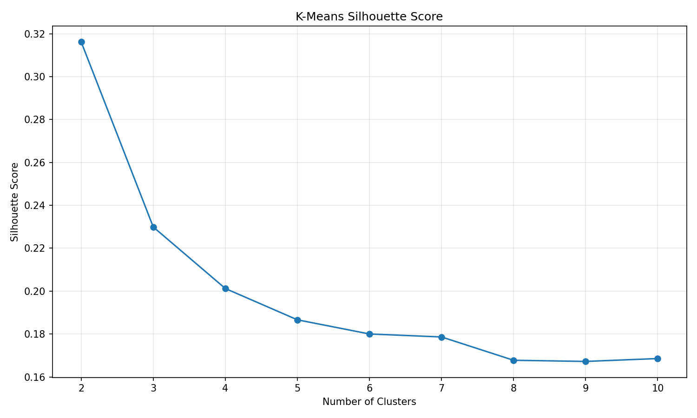 | 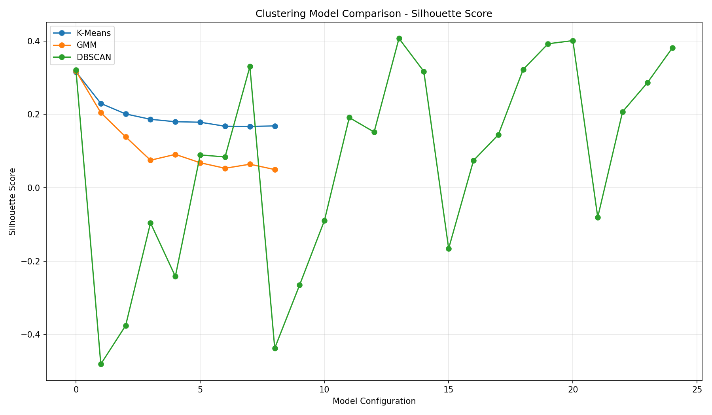 |

| Segment | Customers | Share | Avg. recency | Avg. orders | Avg. revenue | Avg. margin |
|---|---:|---:|---:|---:|---:|---:|
| **Loyal High-Value** | 30 061 | 60.2 % | 95 days | 12.5 | 7 792 | 25.4 % |
| **Occasional / Low-Value** | 19 896 | 39.8 % | 239 days | 6.2 | 3 033 | 23.0 % |

Loyal customers buy **twice as often, ~2.5× more value and 2.5× more recently** – and deliver **79.5 % of revenue** / **81.2 % of profit**.

| PCA projection | Value per segment |
|---|---|
| 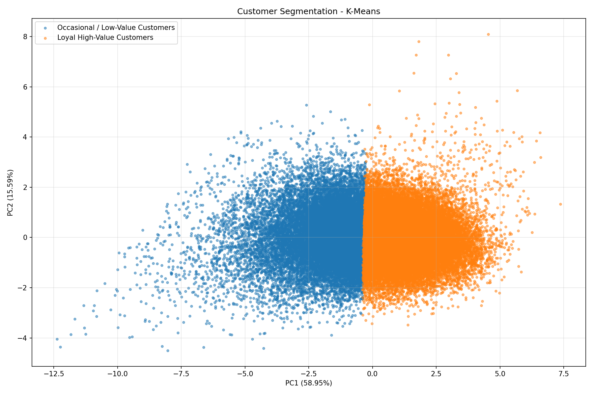 | 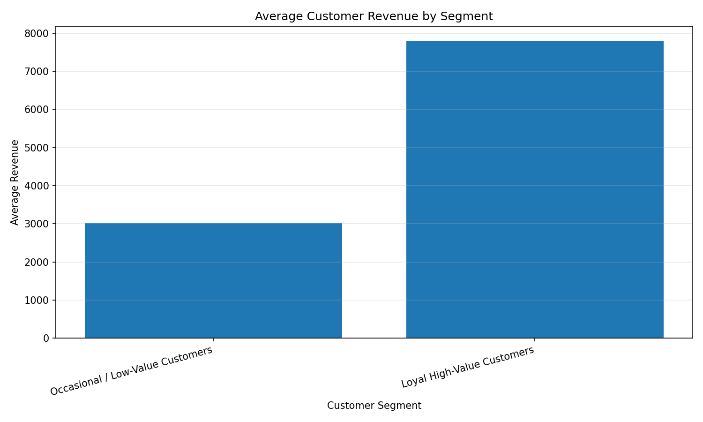 |

### Product segmentation (K-Means, k = 4)

| Segment | Products | Share | Revenue | Margin |
|---|---:|---:|---:|---:|
| **High-Value** | 2 470 | 24.7 % | 187.2 M (63.6 %) | 25.2 % |
| **High-Margin** | 2 789 | 27.9 % | 70.0 M (23.8 %) | **28.4 %** |
| **High-Selling / Low-Margin** | 2 550 | 25.5 % | 28.2 M (9.6 %) | **21.2 %** |
| **Low-Performance** | 2 191 | 21.9 % | 9.2 M (3.1 %) | 24.3 % |

| PCA projection | Revenue per segment |
|---|---|
| 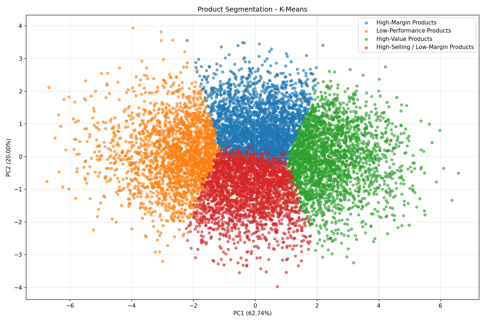 | 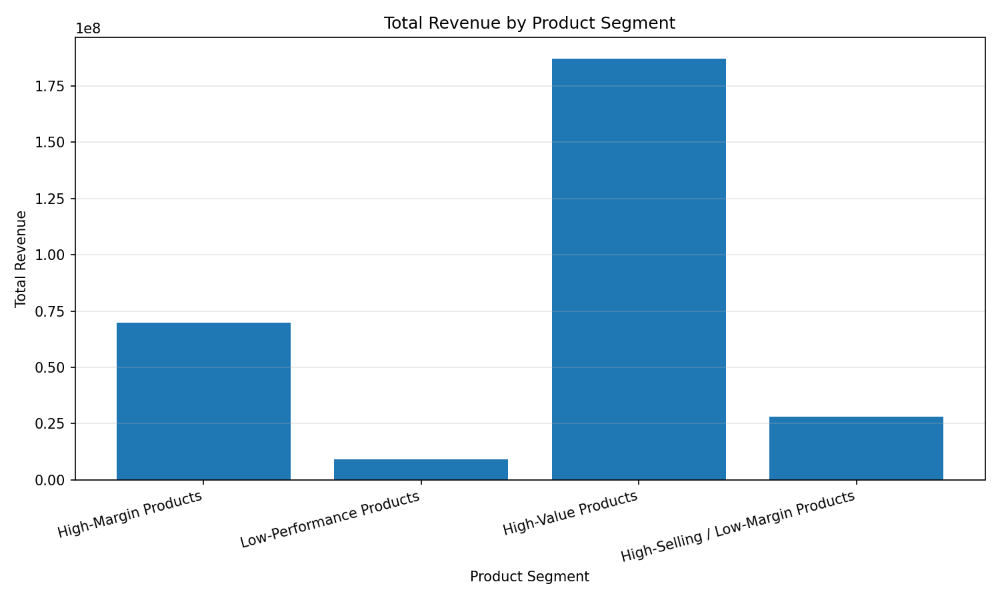 |

**Business implications:** protect and stock-prioritise the *High-Value* group; review pricing of *High-Selling / Low-Margin* items (highest volume, lowest margin); consider range rationalisation for *Low-Performance* products (22 % of the catalogue, 3 % of revenue).

### Market-basket analysis
21 227 unique product pairs → 42 454 directional rules (min. 100 orders per product). Average lift is 19.2 (max 94.7), however almost all pairs co-occur only **2–3 times** (average support ≈ 4.7 × 10⁻⁶, max confidence 3.8 %).

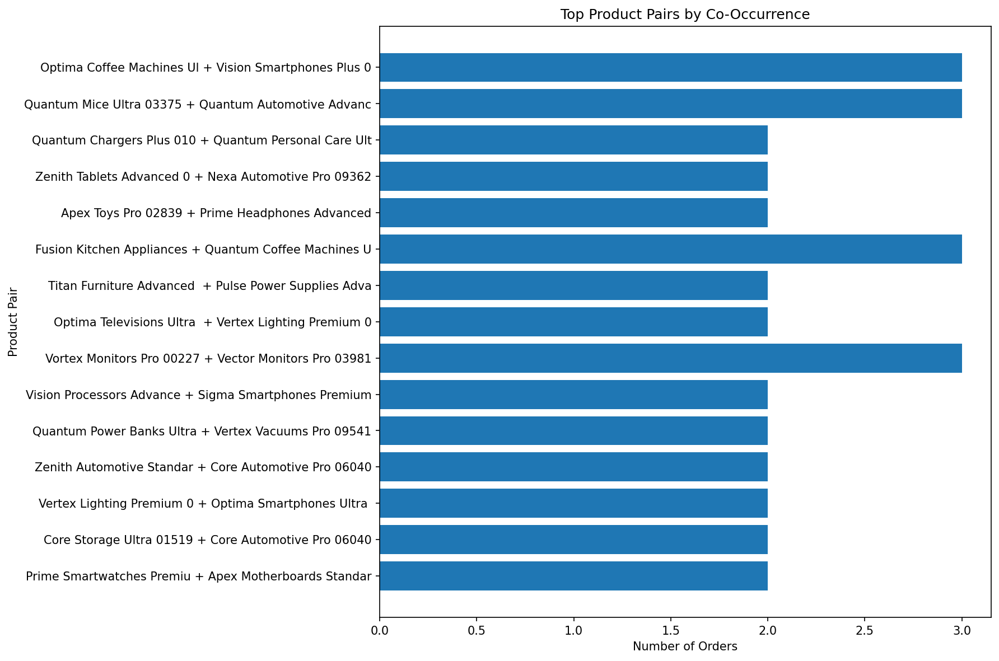

> ⚠️ **Interpretation:** high lift values here are a small-sample effect of very rare co-occurrences. The data does **not** show reliable cross-sell relationships – an honest, and useful, conclusion for a randomly simulated basket. On real data, raise `MIN_PAIR_ORDERS` and add a significance test.

---

## 📊 Power BI dashboard

`powerbi/EcommerceAnalytics_Dark.pbix` – a 4-page, 1920 × 1080 report in a custom **Ecommerce Dark** theme (stored in PBIR format, so it is Git-diff friendly).

| Page | Content |
|---|---|
| **Executive Dashboard** | 7 KPI cards (revenue, cost, profit, margin, orders, units, AOV), revenue & profit trend, revenue by category, top products by revenue / profit, **geographic map** of revenue, slicers for year, month, category and country |
| **Sales Analysis** | Revenue vs profit over time, daily revenue, orders per day, year / month slicers |
| **Product Analysis** | Revenue, profit and units by category, top products by revenue and profit, supplier cost, product scatter (revenue × profit × units) |
| **Customer Analysis** | Customer / revenue / order KPI cards, top customers by profit, revenue by country (donut), detailed customer table |

<!-- Add dashboard screenshots here, e.g.:

-->

---

## 📁 Repository structure

```text
ecommerce-data-platform/
├── generator/
│   └── generate_data.py          # seeded synthetic data generator
├── data/raw/                     # generated CSVs (7 files)
├── etl/
│   ├── load_staging.py           # CSV → staging (COPY)
│   └── load_warehouse.py         # staging → star schema (upserts, batched fact load)
├── sql/
│   ├── 01_data_quality.sql       # 14 data-quality checks
│   ├── 02_sales_analysis.sql
│   ├── 03_customer_analysis.sql
│   └── 04_product_analysis.sql
├── analytics/
│   ├── load_data.py              # DB connection + daily sales loader
│   ├── sales_trends.py
│   ├── advanced_trends.py
│   ├── seasonality.py
│   ├── anomaly_detection.py      # 6-signal ensemble
│   ├── outputs/                  # statistical charts + anomaly_report.csv
│   └── ml/
│       ├── customer_rfm.py
│       ├── customer_segmentation.py
│       ├── product_segmentation.py
│       ├── ml_anomaly_detection.py
│       ├── forecasting.py
│       ├── association_rules.py
│       └── outputs/              # ML charts + CSV results
├── powerbi/
│   └── EcommerceAnalytics_Dark.pbix
├── docs/                         # report + README images
├── requirements.txt
└── LICENSE
```

---

## 🚀 Getting started

### Prerequisites
* Python 3.10+
* PostgreSQL with schemas `staging` and `warehouse` created (see [limitations](#-known-limitations--roadmap))
* Power BI Desktop (to open the `.pbix`)

### 1. Install

```bash
git clone https://github.com/<your-user>/ecommerce-data-platform.git
cd ecommerce-data-platform
python -m venv .venv
source .venv/bin/activate        # Windows: .venv\Scripts\activate
pip install -r requirements.txt
```

### 2. Configure

Create a `.env` file in the project root (it is git-ignored):

```ini
DB_HOST=localhost
DB_PORT=5432
DB_NAME=ecommerce
DB_USER=postgres
DB_PASSWORD=your_password
```

### 3. Run the pipeline

```bash
# 1) Generate data
python generator/generate_data.py

# 2) Load into PostgreSQL
python etl/load_staging.py
python etl/load_warehouse.py

# 3) Validate (run in psql / pgAdmin)
#    sql/01_data_quality.sql

# 4) Statistical analytics (run from the analytics folder)
cd analytics
python sales_trends.py
python advanced_trends.py
python seasonality.py
python anomaly_detection.py

# 5) Machine learning
cd ml
python customer_rfm.py
python customer_segmentation.py
python product_segmentation.py
python ml_anomaly_detection.py
python forecasting.py
python association_rules.py
```

All charts and CSV results are written to `analytics/outputs/` and `analytics/ml/outputs/`.

> 🔁 **Reproducibility note:** the generator is seeded, but the committed result files were produced from a specific dataset snapshot. Re-generating data will yield the same *structure* and *patterns*, with numbers that may differ slightly.

---

## 🧭 Known limitations & roadmap

Being transparent about what the project does **not** yet do:

- [ ] **Add DDL scripts** (`sql/00_schema.sql`) for the `staging` / `warehouse` schemas and the three views (`vw_sales_daily`, `vw_customer_performance`, `vw_product_performance`) so the database can be created from scratch.
- [ ] **Add the clustering benchmark script** (K-Means k = 2…10, GMM, DBSCAN) that produced the comparison CSVs/plots – only the final K-Means fit is currently in the repo.
- [ ] **Fix the 12-month forecast export** – `sales_forecast_12_months.csv` contains a constant value for every month; it should be the monthly aggregate of the 365-day forecast (≈ 72.7 M in total).
- [ ] **Benchmark the forecast** against a seasonal-naïve baseline and add prediction intervals / rolling-origin cross-validation (the current hold-out covers only 30 peak-season days).
- [ ] **Net revenue view** – exclude cancelled / returned orders in a dedicated measure (≈ 23.7 M of the 294.6 M gross).
- [ ] **Association rules** – add statistical-significance filtering and higher minimum support.
- [ ] **Orchestration & CI** – Airflow / Prefect DAG, `pytest` tests for ETL, GitHub Actions lint + test.
- [ ] **Power BI** – surface the ML outputs (segments, forecast, anomalies) inside the report.

---

## 📄 License & author

Released under the [MIT License](LICENSE).

**Paweł Drwal** – data analytics & engineering portfolio project.
